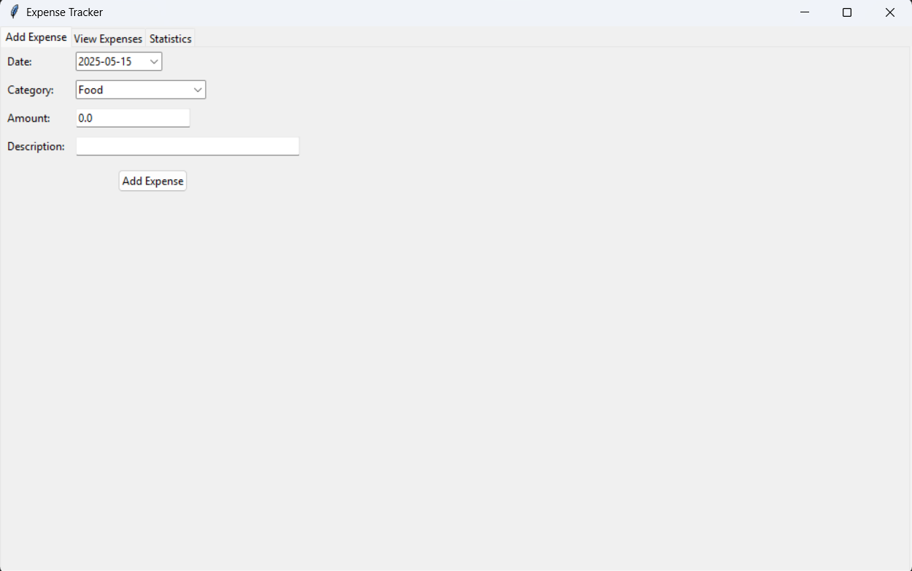
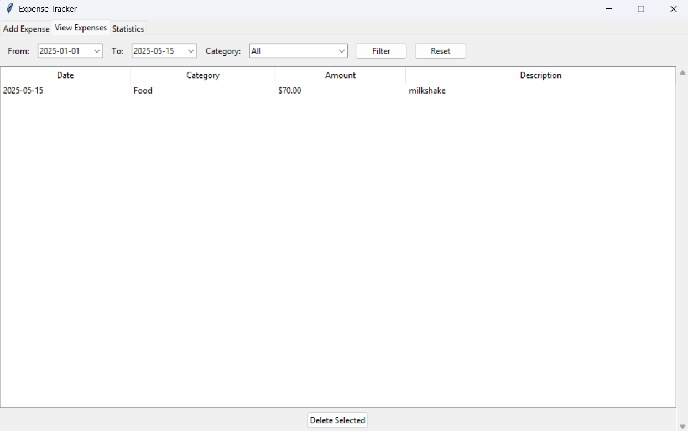
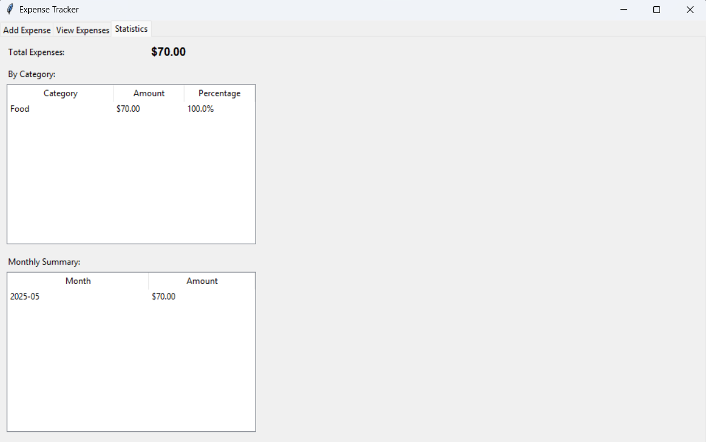

# 🧾 Tkinter Expense Tracker

A simple and user-friendly **Expense Tracker** desktop application built using **Python's Tkinter library**.  
This tool allows users to log daily expenses with date, amount, and category, and automatically saves the data into a CSV file.  
Perfect for managing personal budgets locally without the need for an internet connection.

[](https://www.python.org/)
[](https://docs.python.org/3/library/tkinter.html)
[](https://opensource.org/licenses/MIT)

---

## 📸 Screenshots

| Main Window | View Expenses | Statistics |
|-------------|---------------|------------|
|  |  |  |

---

## ✨ Features

- 🖥️ Easy-to-use Tkinter-based GUI  
- 💰 Add expense with **date**, **amount**, and **description/category**  
- 💾 Data automatically saved in a CSV file  
- 📅 Calendar picker for selecting the date (via `tkcalendar`)  
- 📊 View all entries in a table-like format  
- 📱 Portable — runs on any system with Python installed  

---

## 🗂️ Project Structure

```
Expense-Tracker/
│
├── expense_tracker.py     # Main Python script with UI and logic
├── expenses.csv           # CSV file where expenses are saved (auto-created)
├── requirements.txt       # List of dependencies
├── README.md              # Project documentation
└── screenshots/           # Folder for storing UI screenshots
    ├── main_window.png
    ├── view_expenses.png
    └── statistics.png
```

---

## ⚙️ Installation

### 1. Clone the repository

```bash
git clone https://github.com/jebarson-caleb/Expense-Tracker.git
cd Expense-Tracker
```

### 2. Create a virtual environment (recommended)

```bash
python -m venv venv
source venv/bin/activate   # On Windows: venv\Scripts\activate
```

### 3. Install dependencies

```bash
pip install -r requirements.txt
```

Or install manually:

```bash
pip install tkcalendar
```

> **Note**: `tkinter` is bundled with most Python installations (especially on Windows). If not, install it via your OS package manager.

---

## ▶️ How to Run

```bash
python expense_tracker.py
```

---

## 📄 Sample CSV Output (`expenses.csv`)

```csv
Date,Amount,Category
2025-05-15,500,Groceries
2025-05-16,250,Transportation
```

The CSV file is automatically created on first run in the project directory.

---

## 🛠️ Future Improvements

| Feature | Status | Description |
|---------|--------|-------------|
| Edit entries | 📝 Planned | Modify existing expense records |
| Delete entries | 📝 Planned | Remove individual expense entries |
| Date filtering | 📝 Planned | Filter expenses by date range |
| Monthly summaries | 📝 Planned | View spending patterns by month |
| Data visualization | 📝 Planned | Charts and graphs of spending habits |
| Excel export | 📝 Planned | Save data in Excel format |
| Dark mode | 📝 Planned | Alternative UI theme |

---

## 📦 Dependencies

* `tkinter` – Built-in GUI library in Python
* `tkcalendar` – For date picking functionality

You can install everything with:

```bash
pip install -r requirements.txt
```

---

## 🤝 Contributing

Contributions are welcome! Here's how you can help:

1. Fork this repository
2. Create your feature branch (`git checkout -b feature/amazing-feature`)
3. Commit your changes (`git commit -m 'Add some amazing feature'`)
4. Push to the branch (`git push origin feature/amazing-feature`)
5. Open a Pull Request

You can also open issues if you find any problems or have suggestions.

---

## 📜 License

This project is licensed under the MIT License. See the LICENSE file for details.

---

## 👤 Author

Developed by [jebarson-caleb](https://github.com/jebarson-caleb).

For queries or collaborations, feel free to open an issue or connect via GitHub.

---

<p align="center">
  <sub>Track your expenses. Save your money. 💰</sub>
</p>
